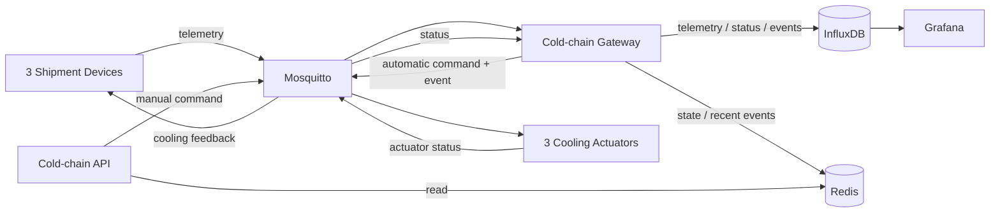

# Virtual Cold-chain Monitoring Gateway

Hệ thống mô phỏng giám sát chuỗi lạnh bằng Docker Compose, MQTT, Python,
Redis, InfluxDB, Grafana và FastAPI.

- **Người 1 - M1 – Infrastructure:** Mosquitto, Redis, InfluxDB, Grafana.
- **Người 2 M2 – Gateway:** quản lý state đa chu kỳ, chạy Rule Engine R1–R6, ghi
  InfluxDB/Redis và phát command MQTT.
- **Người 3 M3 – Edge & API:** ba Shipment Device, ba Cooling Actuator và REST API.

## 1. Kiến trúc



Luồng điều khiển là khép kín: Device phát telemetry, Gateway đánh giá rule
và gửi command, Actuator thay đổi trạng thái rồi publish status. Device nhận
lại status này để mô phỏng tác động thực của cooling lên nhiệt độ.

## 2. Các service

- `mosquitto`: MQTT broker, expose cổng `1883`.
- `redis`: lưu state và danh sách event gần nhất, expose cổng `6379`.
- `influxdb`: time-series database, expose cổng `8086`.
- `grafana`: dashboard giám sát, expose cổng `3000`.
- `shipment-device-01..03`: sinh telemetry theo các kịch bản.
- `cooling-actuator-01..03`: xử lý cooling/alarm command và publish status.
- `coldchain-gateway`: xử lý telemetry, state, rules, command và event.
- `coldchain-api`: truy vấn Redis và gửi command thủ công, expose cổng `8000`.

## 3. Kịch bản mô phỏng

### `shipment-device-01` – `temp_rising`

- Giữ nhiệt độ ổn định trong `5–15` chu kỳ ngẫu nhiên.
- Kích hoạt một đợt tăng nhiệt `0.3–0.8°C` mỗi chu kỳ.
- Giữ nhiệt trên ngưỡng trong `OVERTEMP_MIN_CYCLES` đến
  `OVERTEMP_MAX_CYCLES` để Gateway quan sát được vi phạm đa chu kỳ.
- Khi actuator chuyển sang `high`, nhiệt độ hạ dần. Sau khi R6 đưa
  cooling về `normal`, Device sinh một thời gian chờ ngẫu nhiên mới.

### `shipment-device-02` – `door_open`

- Cửa mở theo từng đợt; Gateway bật alarm sau số chu kỳ cấu hình.
- Tải nhiệt tăng dần khi cửa mở lâu, có thể kích hoạt cooling `high`.
- Khi nhiệt độ phục hồi, cửa đóng và một đợt mở cửa mới được
  lên lịch ngẫu nhiên.

### `shipment-device-03` – `battery_drain`

- Pin giảm nhanh `4–7%` mỗi chu kỳ.
- Phát event pin yếu khi thấp hơn `BATTERY_MIN`.
- Khi pin cạn, Device ngừng telemetry và Gateway phát `device_offline`.

## 4. Cấu hình môi trường

Docker Compose tự động đọc file `.env`; không cần thêm `--env-file`.
File `.env` đã được gitignore. Khi clone project
mới và chưa có `.env`, khởi tạo một lần:

```bash
cp .env.example .env
```

Sau đó thay placeholder token/password trong `.env`. Không lưu credential thật
vào `.env.example`.

Các biến nghiệp vụ chính:

| Biến | Mặc định | Ý nghĩa |
|---|---:|---|
| `TELEMETRY_INTERVAL` | `5` | Chu kỳ telemetry, tính bằng giây |
| `TEMP_MAX` | `8` | Ngưỡng nhiệt độ |
| `TEMP_VIOLATION_CYCLES` | `3` | Số chu kỳ quá nhiệt để phát R1 |
| `OVERTEMP_MIN_CYCLES` | `5` | Thời gian quá nhiệt mô phỏng tối thiểu |
| `OVERTEMP_MAX_CYCLES` | `8` | Thời gian quá nhiệt mô phỏng tối đa |
| `DOOR_OPEN_CYCLES` | `2` | Số chu kỳ cửa mở để phát R3 |
| `BATTERY_MIN` | `20` | Ngưỡng pin yếu |
| `OFFLINE_TIMEOUT` | `30` | Thời gian không có telemetry để phát R5 |
| `EVENTS_KEEP` | `50` | Số event gần nhất giữ trong Redis |
| `STATUS_HEARTBEAT` | `15` | Chu kỳ actuator publish status |

## 5. Chạy hệ thống

Khởi động toàn bộ hệ thống:

```bash
docker compose up -d --build
```

Kiểm tra và xem log:

```bash
docker compose ps
docker compose logs -f coldchain-gateway
docker compose logs -f shipment-device-01
docker compose logs -f cooling-actuator-01
```

Dừng hệ thống:

```bash
docker compose down
```

Xóa cả dữ liệu InfluxDB, Redis và Grafana để khởi tạo lại từ đầu:

```bash
docker compose down -v
```

> Lưu ý: `down -v` xóa toàn bộ dữ liệu trong named volume.

## 6. Truy cập dịch vụ

- Grafana: `http://localhost:3000`.
- InfluxDB: `http://localhost:8086`.
- REST API Swagger: `http://localhost:8000/docs`.
- REST API health: `http://localhost:8000/health`.

Tài khoản InfluxDB và Grafana lấy từ các biến trong env. Khi triển khai thực tế cần mã hóa thay vì viết thẳng trong file môi trường.

## 7. MQTT topic và message

Topic theo từng shipment:

```text
coldchain/<shipment_id>/device/telemetry
coldchain/<shipment_id>/actuator/command
coldchain/<shipment_id>/actuator/status
coldchain/<shipment_id>/gateway/event
```

Telemetry:

```json
{
  "device_id": "device-01",
  "shipment_id": "shipment-01",
  "temperature": 8.7,
  "humidity": 80.2,
  "door_open": false,
  "battery_percent": 98.5,
  "latitude": 21.0045,
  "longitude": 105.8456,
  "timestamp": "2026-06-28T10:00:00Z"
}
```

Command:

```json
{
  "shipment_id": "shipment-01",
  "target": "cooling_unit",
  "action": "increase_power",
  "reason": "temp 8.7C > TEMP_MAX 8.0C",
  "issued_by": "gateway",
  "timestamp": "2026-06-28T10:00:01Z"
}
```

Actuator status:

```json
{
  "shipment_id": "shipment-01",
  "cooling_unit": "high",
  "alarm": false,
  "last_command_reason": "temp 8.7C > TEMP_MAX 8.0C (by gateway)",
  "timestamp": "2026-06-28T10:00:02Z"
}
```

Gateway event:

```json
{
  "shipment_id": "shipment-01",
  "event_type": "temperature_violation",
  "severity": "critical",
  "message": "Nhiệt độ vượt ngưỡng 3 chu kỳ liên tiếp",
  "details": {"temperature": 9.3, "streak": 3, "threshold": 8.0},
  "timestamp": "2026-06-28T10:00:10Z"
}
```

## 8. Rule Engine R1–R6

- **R1:** khi `temperature > TEMP_MAX` đủ `TEMP_VIOLATION_CYCLES`, phát
  `temperature_violation` một lần cho mỗi đợt vi phạm.
- **R2:** khi `temperature > TEMP_MAX` và cooling chưa `high`, gửi
  `increase_power` ngay lập tức.
- **R3:** khi cửa mở đủ `DOOR_OPEN_CYCLES`, phát `door_open_alarm` và
  gửi `alarm_on`; khi cửa đóng lại thì gửi `alarm_off`.
- **R4:** khi `battery_percent < BATTERY_MIN`, phát `battery_low` một lần
  cho tới khi pin phục hồi.
- **R5:** khi không có telemetry quá `OFFLINE_TIMEOUT`, phát
  `device_offline`.
- **R6:** khi nhiệt độ về `<= TEMP_MAX`, gửi `normal_power`; nếu đang có
  vi phạm nhiệt thì phát thêm event `recovered`.

Gateway lưu state theo từng shipment, chống phát event lặp và khôi phục
state từ Redis sau khi restart.

## 9. REST API

Truy vấn:

```bash
curl http://localhost:8000/health
curl http://localhost:8000/shipments
curl http://localhost:8000/shipments/shipment-01/state
curl http://localhost:8000/shipments/shipment-01/events
```

Gửi command thủ công:

```bash
curl -X POST http://localhost:8000/shipments/shipment-01/command \
  -H 'Content-Type: application/json' \
  -d '{"action":"increase_power","reason":"manual control"}'

curl -X POST http://localhost:8000/shipments/shipment-02/command \
  -H 'Content-Type: application/json' \
  -d '{"action":"alarm_on","reason":"manual test"}'
```

Action hợp lệ: `increase_power`, `normal_power`, `alarm_on`, `alarm_off`.

## 10. Kiểm tra MQTT

Theo dõi toàn bộ topic trong một terminal:

```bash
docker compose exec -T mosquitto mosquitto_sub \
  -h localhost -t 'coldchain/#' -v
```

Gửi command chuyển cooling sang `high` từ terminal khác:

```bash
docker compose exec -T mosquitto mosquitto_pub \
  -h localhost -q 1 \
  -t 'coldchain/shipment-01/actuator/command' \
  -m '{"shipment_id":"shipment-01","target":"cooling_unit","action":"increase_power","reason":"manual MQTT test","issued_by":"manual"}'
```

Chuyển về `normal` bằng cách đổi `action` thành `normal_power`. Nếu nhiệt
độ vẫn trên ngưỡng, R2 có thể tự động chuyển actuator lại `high`.

## 11. Lưu trữ và dashboard

Redis:

```text
shipments:index
shipment:<shipment_id>:state
shipment:<shipment_id>:events
```

InfluxDB:

- `telemetry`: tags `shipment_id`, `device_id`; fields `temperature`, `humidity`,
  `door_open`, `battery_percent`.
- `actuator_status`: tag `shipment_id`; fields `cooling_unit` (`off=0`,
  `normal=1`, `high=2`) và `alarm` (`false=0`, `true=1`).
- `events`: tags `shipment_id`, `event_type`, `severity`; fields `value`,
  `message`, `details`, `event_info`, `event_timestamp`.

Dashboard được provision tự động từ
`grafana/dashboards/coldchain-dashboard.json` và hiển thị:

1. Temperature by shipment.
2. Humidity by shipment.
3. Door open status.
4. Battery level.
5. Cumulative temperature violation count.
6. Cooling unit status.
7. Alarm status.
8. Recent event details.
9. Shipment status overview.
10. Event count by type.

## 12. Cấu trúc thư mục

- `coldchain-gateway/`: Gateway, state store, Rule Engine và InfluxDB writer.
- `shipment-device/`: Virtual shipment sensor và các scenario.
- `cooling-actuator/`: Virtual cooling/alarm actuator.
- `coldchain-api/`: FastAPI service.
- `mosquitto/`: cấu hình MQTT broker.
- `grafana/`: datasource, dashboard provisioning và dashboard JSON.
- `docker-compose.yml`: khai báo toàn bộ service, network và volume.
